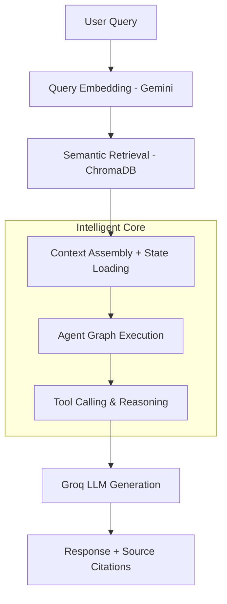

🤖 First Chatbot | Cross-Model RAG Agent System

> **Generative AI Chatbot with Advanced RAG + Multi-Agent Reasoning**  
> A low-latency, document-grounded QA system built with cross-model retrieval and intelligent agent graphs for accurate, scalable conversations.

---

## 🚀 Key Features

- **🔍 Cross-Model RAG Pipeline**: Uses Gemini embeddings for semantic search + Groq LLMs for fast, high-quality generation
- **🧠 Agent Graphs & State Management**: Implements LangGraph-style agent workflows with persistent state for complex multi-turn reasoning
- **📚 ChromaDB Vector Store**: Persistent, efficient document retrieval with clean chunking and metadata handling
- **🛠️ Tool-Based Reasoning**: Clean API boundaries enabling tool calling and external integrations
- **⚡ Low-Latency Design**: Optimized retrieval + generation pipeline for real-time chat experience
- **📖 Document-Grounded Answers**: Every response is traceable back to source documents with citation support

---

## 🏗️ Architecture

The system follows a modular RAG + Agent architecture with clear separation of concerns:



**Core Components:**
- **Retrieval Layer**: Gemini embeddings + ChromaDB
- **Reasoning Layer**: Agent graphs with state management
- **Generation Layer**: Groq LLMs (fast inference)
- **API Layer**: Clean boundaries for scalability

---

## 🛠️ Environment Configuration

Create a `.env` file in the project root:

| Variable              | Description                              |
|-----------------------|------------------------------------------|
| `GROQ_API_KEY`        | API key for Groq LLM access              |
| `GOOGLE_API_KEY`      | API key for Gemini embeddings            |
| `CHROMA_PERSIST_DIR`  | Directory path for ChromaDB storage      |

---

## 📥 Installation

```bash
# Clone the repository
git clone https://github.com/Dibyajyoti001/first_chatbot.git
cd first_chatbot

# Create virtual environment
python -m venv .venv
source .venv/bin/activate     # On Windows: .venv\Scripts\activate

# Install dependencies
pip install -r requirements.txt
```

---

## 🏃 Usage

### Run the Chatbot

```bash
python app.py
```

### Run with Custom Frontend

```bash
python frontend.py
```
## 📤 Output & Capabilities

- Real-time chat interface with source citations
- Persistent conversation memory via agent state
- Document upload support for custom knowledge bases
- Traceable reasoning through agent graphs
- Scalable API-ready design

---

## 👨‍💻 Author

**Dibyajyoti Sarkar**  
📧 sdibyajyoti999@gmail.com  
🔗 [GitHub](https://github.com/Dibyajyoti001) | [LinkedIn](https://www.linkedin.com/in/dibyajyoti-sarkar-781213362/)

*Built as a personal project to explore advanced RAG + Agent architectures.*
```


